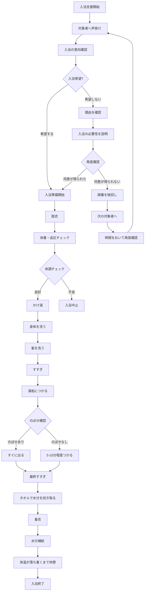

```mermaid
flowchart TD;
    Start[入浴支援開始] --> Voice[対象者へ声掛け]
    Voice --> Ask[入浴の意向確認]
    Ask --> Willing{入浴希望?}
    
    Willing -->|希望する| A[入浴準備開始]
    Willing -->|希望しない| Reason[理由を確認]
    
    Reason --> Explain[入浴の必要性を説明]
    Explain --> ReAsk{再度確認}
    
    ReAsk -->|同意が得られた| A
    ReAsk -->|同意が得られない| Next[順番を後回し]
    Next --> Other[次の対象者へ]
    Other --> Later[時間をおいて再度確認]
    Later --> Voice
    
    A --> B[脱衣]
    B --> C[体重・血圧チェック]
    C --> D{体調チェック}
    D -->|良好| E[かけ湯]
    D -->|不良| X[入浴中止]
    E --> F[身体を洗う]
    F --> G[髪を洗う]
    G --> H[すすぎ]
    H --> I[湯船につかる]
    I --> J{のぼせ確認}
    J -->|のぼせあり| K[すぐに出る]
    J -->|のぼせなし| L[5-10分程度つかる]
    K --> M[最終すすぎ]
    L --> M
    M --> N[タオルで水分を拭き取る]
    N --> O[着衣]
    O --> P[水分補給]
    P --> Q[体温が落ち着くまで休憩]
    Q --> R[入浴終了]
```
