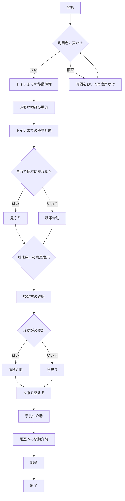

```mermaid
graph TD;
    A[開始] --> B{利用者に声かけ}
    B --> |はい| C[トイレまでの移動準備]
    B --> |拒否| D[時間をおいて再度声かけ]
    D --> B
    
    C --> E[必要な物品の準備]
    E --> F[トイレまでの移動介助]
    
    F --> G{自力で便座に座れるか}
    G --> |はい| H[見守り]
    G --> |いいえ| I[移乗介助]
    
    H --> J{排泄完了の意思表示}
    I --> J
    
    J --> K[後始末の確認]
    K --> L{介助が必要か}
    L --> |はい| M[清拭介助]
    L --> |いいえ| N[見守り]
    
    M --> O[衣服を整える]
    N --> O
    
    O --> P[手洗い介助]
    P --> Q[居室への移動介助]
    Q --> R[記録]
    R --> S[終了]
```
