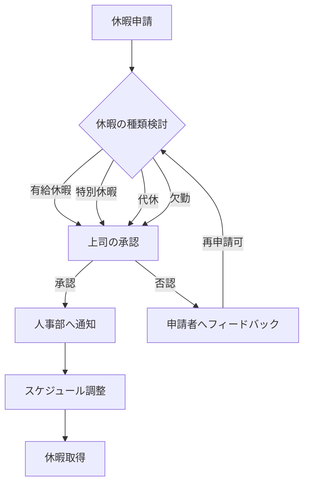

# mermaid_practice

```mermaid
graph TD;
    A[休暇申請] --> B{休暇の種類検討}
    B -- 有給休暇 --> C[上司の承認]
    B -- 特別休暇 --> C
    B -- 代休 --> C
    B -- 欠勤 --> C

    C -- 承認 --> D[人事部へ通知]
    D --> E[スケジュール調整]
    E --> F[休暇取得]

    C -- 否認 --> G[申請者へフィードバック]
    G -->|再申請可| B
```
