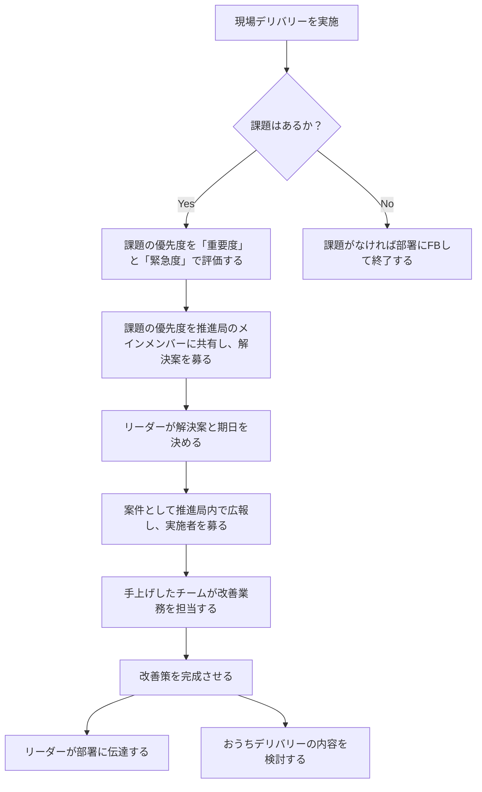

```mermaid
flowchart TD;
    A[現場デリバリーを実施]
    B{課題はあるか？}
    C[課題の優先度を「重要度」と「緊急度」で評価する]
    D[課題がなければ部署にFBして終了する]
    E[課題の優先度を推進局のメインメンバーに共有し、解決案を募る]
    F[リーダーが解決案と期日を決める]
    G[案件として推進局内で広報し、実施者を募る]
    H[手上げしたチームが改善業務を担当する]
    I[改善策を完成させる]
    J[リーダーが部署に伝達する]
    K[おうちデリバリーの内容を検討する]


    A --> B
    B -- Yes --> C
    B -- No --> D
    C --> E
    E --> F
    F --> G
    G --> H
    H --> I
    I --> J
    I --> K
```
