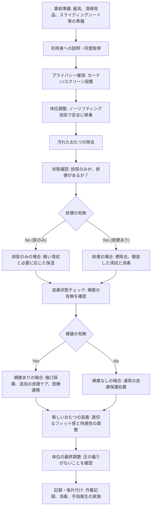

```mermaid
graph TD;
    A[事前準備: 器具、清掃用品、スライディングシート等の準備]
    B[利用者への説明・同意取得]
    C[プライバシー確保: カーテン/スクリーン設置]
    D[体位調整: ノーリフティング技術で安全に移乗]
    E[汚れたおむつの除去]
    F[状態確認: 排尿のみか、排便があるか？]
    G{排便の有無}
    H[排尿のみの場合: 軽い清拭と必要に応じた保湿]
    I[排便の場合: 便除去、徹底した清拭と消毒]
    J[皮膚状態チェック: 褥瘡の有無を確認]
    K{褥瘡の有無}
    L[褥瘡ありの場合: 傷口保護、追加の皮膚ケア、医療連携]
    M[褥瘡なしの場合: 通常の皮膚保護処置]
    N[新しいおむつの装着: 適切なフィット感と快適性の調整]
    O[体位の最終調整: 圧の偏りがないことを確認]
    P[記録・後片付け: 作業記録、消毒、手指衛生の実施]

    A --> B
    B --> C
    C --> D
    D --> E
    E --> F
    F --> G
    G -- No (尿のみ) --> H
    G -- Yes (排便あり) --> I
    H --> J
    I --> J
    J --> K
    K -- Yes --> L
    K -- No --> M
    L --> N
    M --> N
    N --> O
    O --> P
```
