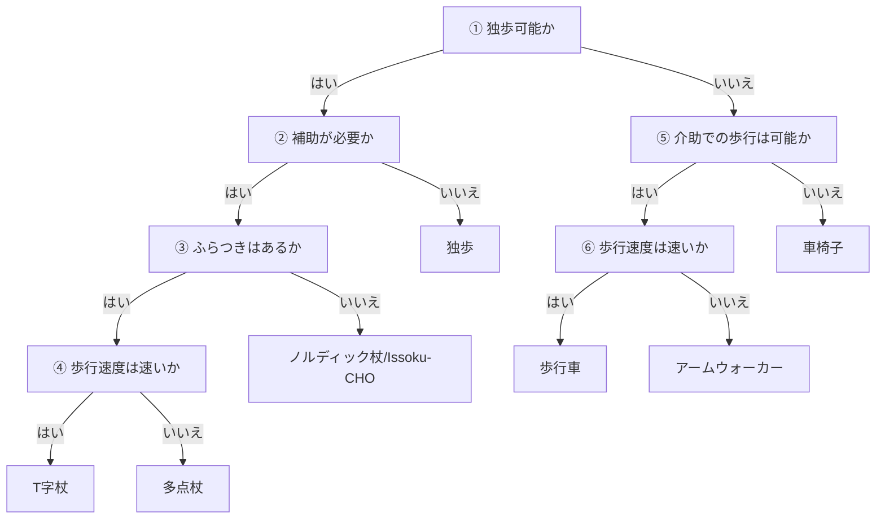

```mermaid

flowchart TD
    A[① 独歩可能か]
    B[② 補助が必要か]
    C[③ ふらつきはあるか]
    D[④ 歩行速度は速いか]
    E[⑤ 介助での歩行は可能か]
    F[⑥ 歩行速度は速いか]

    A -- はい --> B
    A -- いいえ --> E

    B -- はい --> C
    B -- いいえ --> 独歩

    C -- はい --> D
    C -- いいえ --> ノルディック杖/Issoku-CHO

    D -- はい --> T字杖
    D -- いいえ --> 多点杖

    E -- はい --> F
    E -- いいえ --> 車椅子

    F -- はい --> 歩行車
    F -- いいえ --> アームウォーカー

```
