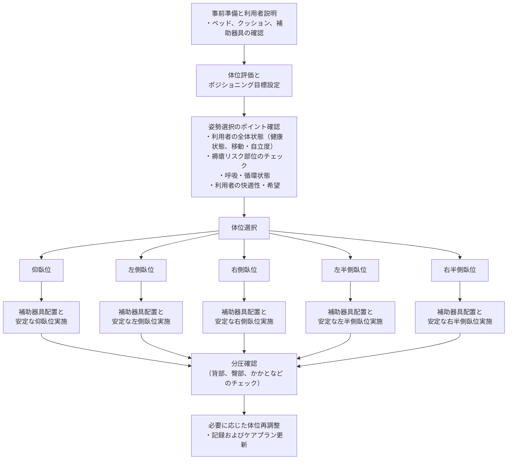

```mermaid
graph TD;
    A[事前準備と利用者説明<br>・ベッド、クッション、補助器具の確認]
    A --> B[体位評価と<br>ポジショニング目標設定]
    B --> C[姿勢選択のポイント確認<br>・利用者の全体状態（健康状態、移動・自立度）<br>・褥瘡リスク部位のチェック<br>・呼吸・循環状態<br>・利用者の快適性・希望]
    C --> D[体位選択]
    
    D --> D1[仰臥位]
    D --> D2[左側臥位]
    D --> D3[右側臥位]
    D --> D4[左半側臥位]
    D --> D5[右半側臥位]
    
    D1 --> E1[補助器具配置と<br>安定な仰臥位実施]
    D2 --> E2[補助器具配置と<br>安定な左側臥位実施]
    D3 --> E3[補助器具配置と<br>安定な右側臥位実施]
    D4 --> E4[補助器具配置と<br>安定な左半側臥位実施]
    D5 --> E5[補助器具配置と<br>安定な右半側臥位実施]
    
    E1 --> F[分圧確認<br>（背部、臀部、かかとなどのチェック）]
    E2 --> F
    E3 --> F
    E4 --> F
    E5 --> F
    
    F --> G[必要に応じた体位再調整<br>・記録およびケアプラン更新]
```
