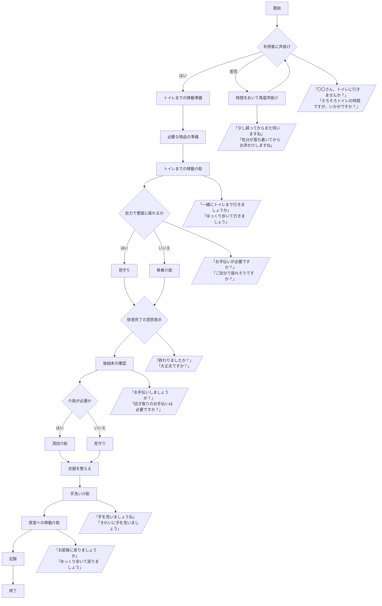

```mermaid
graph TD
    A[開始] --> B{利用者に声掛け}
    B --> |はい| C[トイレまでの移動準備]
    B --> |拒否| D[時間をおいて再度声掛け]
    D --> B
    
    C --> E[必要な物品の準備]
    E --> F[トイレまでの移動介助]
    
    F --> G{自力で便座に座れるか}
    G --> |はい| H[見守り]
    G --> |いいえ| I[移乗介助]
    
    H --> J{排泄完了の意思表示}
    I --> J
    
    J --> K[後始末の確認]
    K --> L{介助が必要か}
    L --> |はい| M[清拭介助]
    L --> |いいえ| N[見守り]
    
    M --> O[衣服を整える]
    N --> O
    
    O --> P[手洗い介助]
    P --> Q[居室への移動介助]
    Q --> R[記録]
    R --> S[終了]

    %% 声掛けの具体例
    B1[/"「〇〇さん、トイレに行きませんか？」
    「そろそろトイレの時間ですが、いかがですか？」"/]
    B --> B1
    
    D1[/"「少し経ってからまた伺いますね」
    「気分が落ち着いてからお声かけしますね」"/]
    D --> D1
    
    F1[/"「一緒にトイレまで行きましょうか」
    「ゆっくり歩いて行きましょう」"/]
    F --> F1
    
    G1[/"「お手伝いが必要ですか？」
    「ご自分で座れそうですか？」"/]
    G --> G1
    
    J1[/"「終わりましたか？」
    「大丈夫ですか？」"/]
    J --> J1
    
    K1[/"「お手伝いしましょうか？」
    「拭き取りのお手伝いは必要ですか？」"/]
    K --> K1
    
    P1[/"「手を洗いましょうね」
    「きれいに手を洗いましょう」"/]
    P --> P1
    
    Q1[/"「お部屋に戻りましょうか」
    「ゆっくり歩いて戻りましょう」"/]
    Q --> Q1
```
