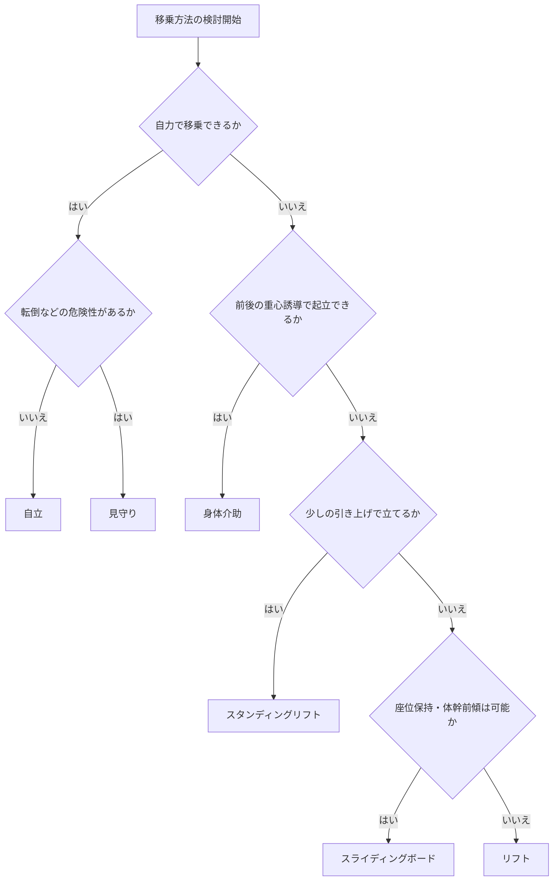

```mermaid
flowchart TD;
    Start[移乗方法の検討開始] --> A{自力で移乗できるか}
    
    A -->|はい| B{転倒などの危険性があるか}
    A -->|いいえ| C{前後の重心誘導で起立できるか}
    
    B -->|いいえ| D[自立]
    B -->|はい| E[見守り]
    
    C -->|はい| F[身体介助]
    C -->|いいえ| G{少しの引き上げで立てるか}
    
    G -->|はい| H[スタンディングリフト]
    G -->|いいえ| I{座位保持・体幹前傾は可能か}
    
    I -->|はい| J[スライディングボード]
    I -->|いいえ| K[リフト]
```
